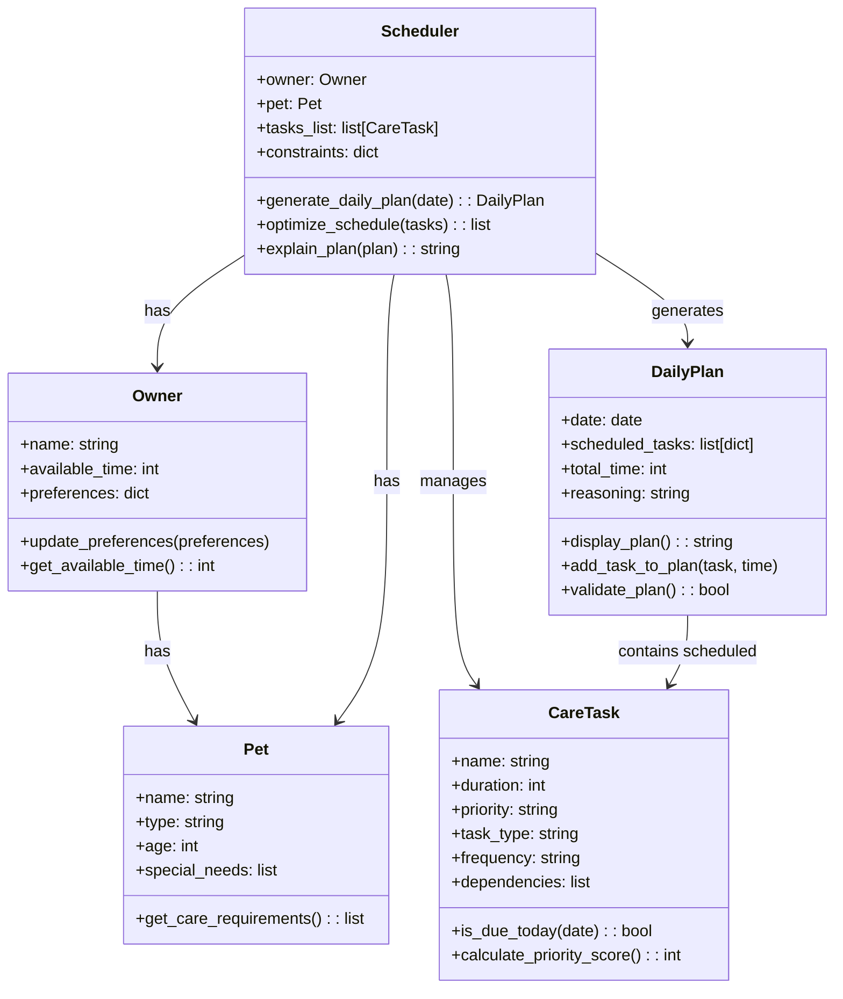

# PawPal+ Project Reflection

## 1. System Design

**a. Initial design**

The initial UML design consists of a class diagram with 5 main classes representing the core components of the PawPal+ pet care planning system: Owner, Pet, CareTask, Scheduler, and DailyPlan. The design follows object-oriented principles with clear separation of concerns, using dataclasses for data-focused classes (Owner, Pet, CareTask, DailyPlan) to keep the code clean and concise, while using a regular class for the Scheduler which contains the main business logic. Relationships show that Owner has a Pet, Scheduler manages Owner, Pet, CareTasks, and generates DailyPlans, and DailyPlans contain scheduled CareTasks.

The classes included and their responsibilities are:

1. **Owner**: Represents the pet owner, responsible for storing personal information (name, available time) and preferences (e.g., preferred walk times). It provides methods to update and retrieve preferences and available time.

2. **Pet**: Represents the pet, responsible for holding basic pet information (name, type, age, special needs). It provides a method to return default care requirements based on the pet's type.

3. **CareTask**: Represents individual pet care tasks, responsible for storing task details (name, duration, priority, type, frequency, dependencies). It includes methods to check if the task is due on a given date and calculate a priority score for scheduling.

4. **Scheduler**: The central logic class, responsible for managing the scheduling process. It holds references to the owner, pet, task list, and constraints, and provides methods to generate daily plans, optimize task schedules, and explain the reasoning behind plans.

5. **DailyPlan**: Represents the generated daily care schedule, responsible for storing the date, list of scheduled tasks with times, total time, and reasoning. It provides methods to display the plan, add tasks to it, and validate the plan's feasibility.

Based on brainstorming the main objects needed for the PawPal+ system, the following classes were identified:

1. **Owner**
   - **Attributes**: name (string), available_time (int, daily hours available), preferences (dict, e.g., preferred walk times, dietary restrictions)
   - **Methods**: update_preferences(preferences), get_available_time() -> int

2. **Pet**
   - **Attributes**: name (string), type (string, e.g., 'dog', 'cat'), age (int), special_needs (list of strings)
   - **Methods**: get_care_requirements() -> list (returns default tasks based on pet type)

3. **CareTask**
   - **Attributes**: name (string), duration (int, minutes), priority (string/enum: 'high', 'medium', 'low'), task_type (string, e.g., 'walk', 'feeding'), frequency (string, e.g., 'daily'), dependencies (list of task names)
   - **Methods**: is_due_today(date) -> bool, calculate_priority_score() -> int

4. **Scheduler**
   - **Attributes**: owner (Owner instance), pet (Pet instance), tasks_list (list of CareTask), constraints (dict, e.g., max_daily_time)
   - **Methods**: generate_daily_plan(date) -> DailyPlan, optimize_schedule(tasks) -> list, explain_plan(plan) -> string

5. **DailyPlan**
   - **Attributes**: date (date), scheduled_tasks (list of dicts with task and time), total_time (int, minutes), reasoning (string)
   - **Methods**: display_plan() -> string, add_task_to_plan(task, time), validate_plan() -> bool

**UML Class Diagram**

**b. Design changes**

Yes, the design evolved during the initial implementation phase when creating the Python class skeletons. Several refinements were made to address missing relationships and improve type safety:

1. **Added Owner-Pet relationship**: The initial UML showed Owner has Pet, but the skeleton code didn't reflect this. Added a `pet` attribute to the `Owner` class and removed the redundant separate `pet` parameter from `Scheduler` to properly model the ownership relationship.

2. **Introduced enums for better type safety**: Replaced string-based `priority` and `frequency` attributes in `CareTask` with `Enum` classes (`Priority` and `Frequency`) to prevent invalid values and provide better validation at runtime.

3. **Structured scheduled tasks**: Created a `ScheduledTask` dataclass to replace the vague `List[Dict[str, Any]]` in `DailyPlan`, providing clearer structure and type safety for representing scheduled tasks with their start times.

4. **Improved method return types**: Changed `Pet.get_care_requirements()` to return `List[CareTask]` instead of `List[str]` for more useful and type-safe data that can be directly used in scheduling logic.

These changes were made to make the code more robust, maintainable, and aligned with the UML design, preventing potential runtime errors and improving the overall system architecture before implementing the scheduling logic.

**c. Core Actions**

Based on the README.md, the three core actions a user should be able to perform are:

1. Enter basic owner and pet information.
2. Add or edit pet care tasks (including duration and priority).
3. Generate and view a daily care schedule/plan based on constraints and priorities.

---

## 2. Scheduling Logic and Tradeoffs

**a. Constraints and priorities**

- What constraints does your scheduler consider (for example: time, priority, preferences)?
- How did you decide which constraints mattered most?

**b. Tradeoffs**

- Describe one tradeoff your scheduler makes.
- Why is that tradeoff reasonable for this scenario?

---

## 3. AI Collaboration

**a. How you used AI**

- How did you use AI tools during this project (for example: design brainstorming, debugging, refactoring)?
- What kinds of prompts or questions were most helpful?

**b. Judgment and verification**

- Describe one moment where you did not accept an AI suggestion as-is.
- How did you evaluate or verify what the AI suggested?

---

## 4. Testing and Verification

**a. What you tested**

- What behaviors did you test?
- Why were these tests important?

**b. Confidence**

- How confident are you that your scheduler works correctly?
- What edge cases would you test next if you had more time?

---

## 5. Reflection

**a. What went well**

- What part of this project are you most satisfied with?

**b. What you would improve**

- If you had another iteration, what would you improve or redesign?

**c. Key takeaway**

- What is one important thing you learned about designing systems or working with AI on this project?
